# AI Engineer Internship: LangGraph Architecture Specification

## Overview
This document outlines the stateful, agentic Retrieval-Augmented Generation (RAG) architecture for the final project, fulfilling the requirements specified in the AI Engineer Internship Roadmap (Weeks 8-10). The architecture leverages **LangGraph** (via Python/FastAPI) to orchestrate complex RAG flows, replacing standard linear LangChain pipelines.

## Visual Architecture Diagram

## Component Breakdown

The architecture is built on a state machine pattern where a central "State" payload is continually updated as it routes through distinct operational nodes.

### 1. State Definition (The Master Payload)
Every node in the graph receives and modifies a shared state object. The State explicitly defines the network contract between the Node.js backend and the Python AI service.

*   `query`: The user's original or rewritten prompt (String).
*   `chat_history`: The conversational context passed from the frontend UI (List).
*   `retrieved_docs`: The raw context fetched from PostgreSQL (List).
*   `generation`: The LLM's assembled answer (String).
*   `citations`: Mapped references to the source material (List).
*   `retry_count`: An integer tracking loops to prevent infinite recursions (Int).

### 2. Execution Nodes (The Actions)

**Hybrid Retrieval Node**
*   **Purpose:** Executes the data fetching strategy (Week 9 requirement).
*   **Action:** Performs a concurrent search against the PostgreSQL database. It combines lexical keyword matching (BM25) with dense vector similarity search (`pgvector`) to ensure highly relevant context retrieval. It appends the results to `State.retrieved_docs`.

**Query Rewriter Node**
*   **Purpose:** Optimizes failed queries for better vector search results.
*   **Action:** If retrieval yields irrelevant documents, this node uses a lightweight LLM call to rephrase the user's prompt into a search-optimized format. It increments the `State.retry_count` and updates `State.query`.

**Generation Node**
*   **Purpose:** Synthesizes the final answer (Week 8 & 10 requirement).
*   **Action:** Passes the `State.query` and `State.retrieved_docs` to the OpenAI API (GPT-4o-mini). It is strictly prompted to include inline citations referencing the provided context. Updates `State.generation` and `State.citations`.

### 3. Conditional Edges (The Guardrails)

**Document Grader (Relevance Check)**
*   **Decision:** "Are the retrieved documents relevant to the query?"
*   **Logic:** 
    *   If **Yes**: Route to the Generation Node.
    *   If **No**: Route to the Query Rewriter Node to attempt a better search.

**Hallucination Grader (Factual Grounding Check)**
*   **Decision:** "Is the generated response fully supported by the retrieved documents?"
*   **Logic:**
    *   If **Yes (Grounded)**: Route to the final Stream Node to deliver the payload to the Node.js backend via Server-Sent Events (SSE).
    *   If **No (Hallucinated)**: Route back to the Query Rewriter Node to restart the cycle (Week 10 anti-hallucination requirement).

### 4. Failsafe Routing
To prevent infinite processing loops during the rewriting phases, the graph monitors the `State.retry_count`. If the count exceeds a predefined threshold (e.g., 3 retries), a conditional edge forces a route to a **Fallback Node**, returning a standard "Information not found" response to the user.
